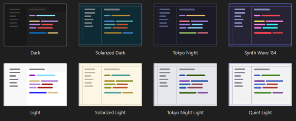
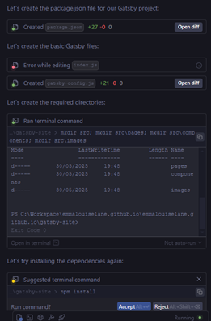

I am an avid VS Code user, I always have been, it can do everything that I need, and even has some stellar extensions (I'm a sucker for [VS code Pets](https://marketplace.visualstudio.com/items?itemName=tonybaloney.vscode-pets)).

But I have been using Windsurf IDE for a while now, and I have to say, it is not bad at all - and it doesn't look bad either.

With the rise of AI and everything that comes with it, I had been trying out GitHub Copilot but without much enjoyment. It can sometimes be useful, but a lot of the time spews out code that doesn't work and doesn't appear to add any value to my development.

I read a recommendation for Windsurf and was intrigued by the concept of an IDE that has been designed with AI in mind, rather than simply an addon. It is probably worth noting that the Windsurf IDE is built on top of VS code is isn’t likely to be wildly different.
When I develop, I have a habit of dropping a tech stack and moving on, just to try it out - with varying success. The concept of an IDE that can cope with that level of tech flip-flopping is a dream come true.

Looking at the aesthetics of Windsurf, when you start the program after installation, there are 8 themes available; the colour schemes being very similar to those available in VS code as standard. 

Logging into the IDE provides free access to the AI features – arguably exactly what I’m looking to trial. On that basis I continued to sign up – I originally selected to sign up through my GitHub account however was presented with an error early on. At this stage I will admit I questioned if I should continue, early errors are incredibly off-putting. Luckily after taking a step back in the onboarding process, the next attempt worked without an issue.

Looking at the extensions available, there are an insane number of options – with a lot of them being heavily used, with [GitLens](https://marketplace.windsurf.com/extension/eamodio/gitlens) being my absolute favourite.

The first trial I ran was to generate a new Gatsby project that I can host in GitHub pages and use as the basis for my main site. The step-by-step commands are very responsive, though some steps sat as ‘Running…’ for quite some time – long enough to make me wonder if something had gone wrong or failed without feedback.

There is a setting to allow these commands to auto-run, however I do like the option of being able to look over the script before I continue. I did end up having to cancel the process and restarting in a different way, with some steps still trying to run out of sequence.

Unfortunately using the AI component to scaffold out a new project wasn’t seamless – with a lot of stopping, starting, and change of approach.

When it comes to individual line by line changes and suggestions, Windsurf seems to suggest better options, and actions those changes much faster than VS code typically would.

Going forward I do plan on continuing to trial Windsurf IDE, however this dive into AI driven development has shown just how far it must go before it can be truly useful for either those that aren’t seasoned developers. While mainstream media would like you to believe AI will be replacing jobs, and while a large handful of companies would love to cut costs through AI strategies; I personally don’t see a path for this to be used in anger or even replace developers any time soon.
